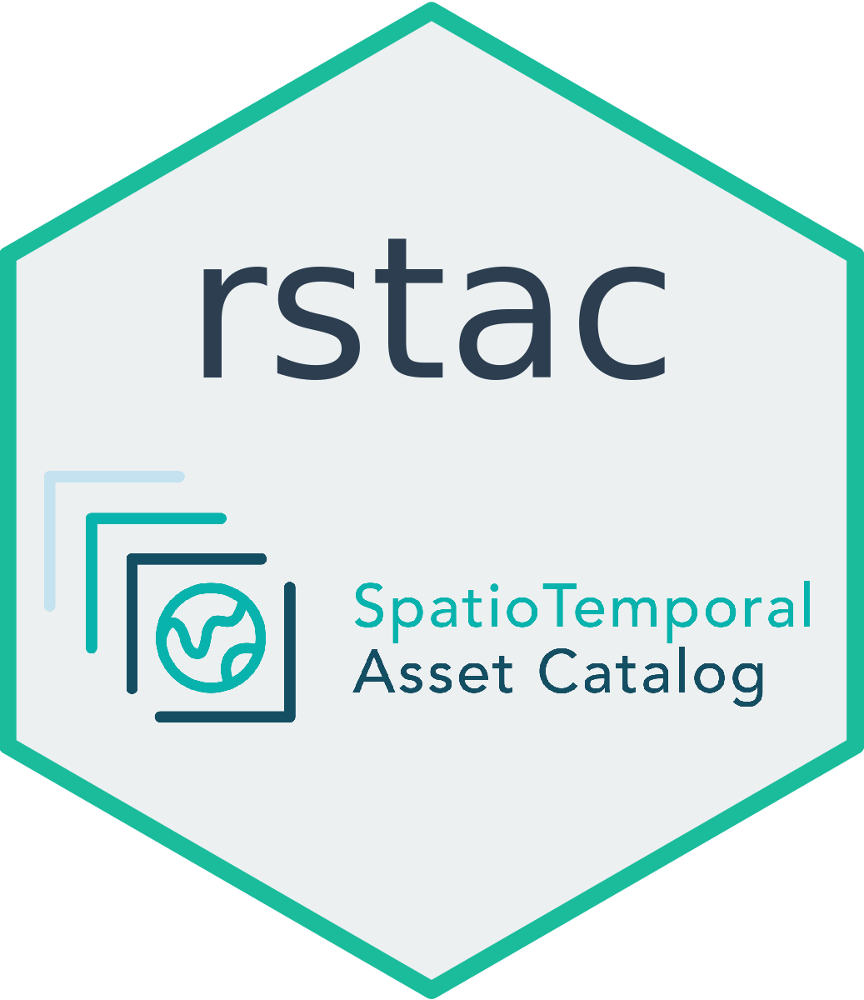

# rstac 
R Client Library for SpatioTemporal Asset Catalog (rstac)

[](https://travis-ci.com/OldLipe/stac.R) [](https://ci.appveyor.com/project/OldLipe/stac-r) [](https://codecov.io/gh/OldLipe/stac.R)

STAC is a specification of files and web services used to describe geospatial information assets.
The specification can be consulted in [https://stacspec.org/].

R client library for STAC (`rstac`) was designed to fully support STAC v0.8.0. 
As STAC spec is evolving fast and reaching its maturity, we plan update `rstac` to support upcoming STAC 1.0.0 version soon.

## Installation

To install `rstac` for R, run the following commands 

```R
library(devtools)
install_github("brazil-data-cube/stac.R")
```

## Usage

In this version, we implemented STAC endpoints (`'/stac'`, `'/stac/search'`) as well as
WFS3 endpoints (`'/collections'`, `'/collections/{collectionId}'`, 
`'/collections/{collectionId}/items'`, and `'/collections/{collectionId}/items/{itemId}'`).

```R
library(rstac)
library(magrittr)

# Create a stac object and return a STAC Catalog
stac_catalog <- stac("http://brazildatacube.dpi.inpe.br/bdc-stac/0.8.0") %>%
                get_request()
    

# Create a stac_items object and return STAC items
items <- stac_search(url = "http://brazildatacube.dpi.inpe.br/bdc-stac/0.8.0",
                    collections = "MOD13Q1",
                    bbox = c(-55.16335, -4.26325, -49.31739, -1.18355)) %>%
        get_request()
        
# Create a stac object and returns a list of STAC Collections
col <- stac_collections("http://brazildatacube.dpi.inpe.br/bdc-stac/0.8.0") %>%
       get_request()

```

### Items functions

```R
# Pagination of items in the `stac_items` object
items %>% items_fetch()

# Count how many items matched the search criteria
items %>% items_matched()

# Count how many items are in the `stac_items` object
items %>% items_length()
```

### Download assets

```R
# Downloads the assets provided by the STAC API
download_items <- 
  items %>% assets_download(assets_name = c("thumbnail"))
```
